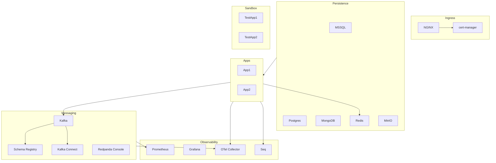

# k8s-homelab

A local, Kubernetes environment built with **Minikube** for experimenting, development, and reproducible demos.
All manifests and Helm values are versioned here so the entire environment can be spun up on any machine.

---

## Prerequisites

Make sure you have the following installed locally:

* [Minikube](https://minikube.sigs.k8s.io/docs/start/) ≥ 1.33
* [kubectl](https://kubernetes.io/docs/tasks/tools/) ≥ 1.29
* [Helm](https://helm.sh/docs/intro/install/) ≥ 3.14
* [Git](https://git-scm.com/) ≥ 2.40

Optional (but recommended):
* [Aptakube](https://aptakube.com/) — **recommended UI** for managing namespaces and resources
* [jq](https://stedolan.github.io/jq/) — for JSON inspection
* [mkcert](https://github.com/FiloSottile/mkcert) — if you want to generate a trusted local CA instead of using cert-manager’s self-signed CA

---

## Quick Start

1. **Start Minikube with enough resources:**

   ```bash
   minikube start --cpus=6 --memory=12288 --disk-size=40g --driver=docker
   ```

2. **Clone the repo:**

   ```bash
   git clone <your-repo-url> k8s-homelab
   cd k8s-homelab
   ```

3. **Apply namespaces:**

   ```bash
   ./ops/apply-namespaces.sh
   ```

4. **Enable NGINX Ingress addon:**

   ```bash
   minikube addons enable ingress
   ```

5. **Add hosts entries (replace with your Minikube IP):**

   ```bash
   echo "$(minikube ip) kafka.local schema.local connect.local redpanda.local \
   seq.local grafana.local prometheus.local otel.local \
   minio.local mongo.local pg.local mssql.local redis.local \
   test.sandbox.local" | sudo tee -a /etc/hosts
   ```

---

## Repository Structure

```
k8s-homelab/
├── namespaces/          # Namespace manifests (ingress, persistence, messaging, observability, apps, sandbox)
├── ingress/             # Ingress rules (per service)
├── cert-manager/        # Issuers, self-signed CA, TLS configs
├── apps/                # Service deployments (Kafka, Postgres, etc.)
│   ├── kafka/
│   ├── kafka-connect/
│   ├── schema-registry/
│   ├── redpanda-console/
│   ├── redis/
│   ├── minio/
│   ├── mssql/
│   ├── postgresql/
│   ├── mongodb/
│   ├── seq/
│   ├── prometheus-grafana/
│   └── otel-collector/
└── ops/                 # Helper scripts (e.g., apply-namespaces.sh, CI/CD automation)
```

---

## Namespaces & Roles

| Namespace         | Purpose                              | Services / Components                                                               |
| ----------------- | ------------------------------------ | ----------------------------------------------------------------------------------- |
| **ingress**       | Entry, TLS, traffic routing          | NGINX Ingress Controller, cert-manager, Ingress resources                           |
| **persistence**   | Databases & storage                  | MSSQL, PostgreSQL, MongoDB, Redis, MinIO                                            |
| **messaging**     | Event streaming & integration layer  | Kafka (KRaft), Schema Registry, Kafka Connect, Redpanda Console                     |
| **observability** | Metrics, tracing, logging            | Prometheus, Grafana, Seq, OpenTelemetry Collector                                   |
| **apps**          | Application workloads (stable demos) | Your microservices, APIs, test applications                                         |
| **sandbox**       | Experiments / junkyard               | Throwaway workloads, canaries, PoCs, test data. Accessible under `*.sandbox.local`. |

---

## Hostname Conventions

* Core stack: `*.local`
  * Examples: `kafka.local`, `schema.local`, `grafana.local`
  
* Sandbox workloads: `*.sandbox.local`
  * Examples: `test.sandbox.local`, `kcat.sandbox.local`

TLS is managed by **cert-manager** with two `ClusterIssuer`s:

* One for `*.local`
* One for `*.sandbox.local`

---

## Architecture



---

## Namespaces as Layers (High-Level View)

```mermaid
flowchart TB
    ingress([Ingress\nNGINX, cert-manager]):::layer --> persistence([Persistence\nMSSQL, Postgres, MongoDB, Redis, MinIO]):::layer
    ingress --> messaging([Messaging\nKafka, Connect, Schema Registry, Redpanda Console]):::layer
    messaging --> observability([Observability\nPrometheus, Grafana, Seq, OTel]):::layer
    persistence --> apps([Apps\nYour Services]):::layer
    messaging --> apps
    apps --> sandbox([Sandbox\nExperiments, PoCs]):::layer

    classDef layer fill=#222,stroke=#888,color=#fff,rx=8,ry=8
```

---

## Workflow

1. **Namespaces** → create with `ops/apply-namespaces.sh`
2. **Ingress + cert-manager** → enable NGINX addon, install cert-manager, set up issuers
3. **Persistence layer** → deploy MSSQL, Postgres, Mongo, Redis, MinIO
4. **Messaging layer** → deploy Kafka (KRaft), Schema Registry, Kafka Connect, Redpanda Console
5. **Observability** → deploy Prometheus, Grafana, Seq, OTel Collector
6. **Apps & Sandbox** → deploy your workloads under `apps` or experiments in `sandbox`
